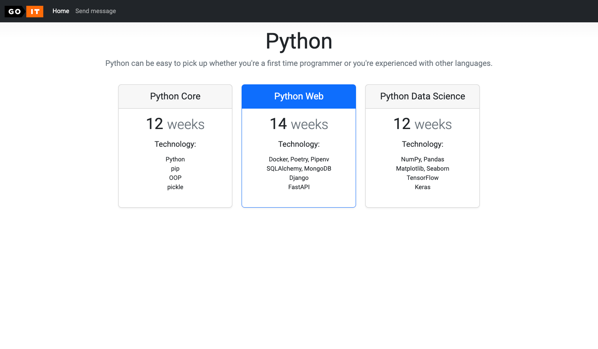
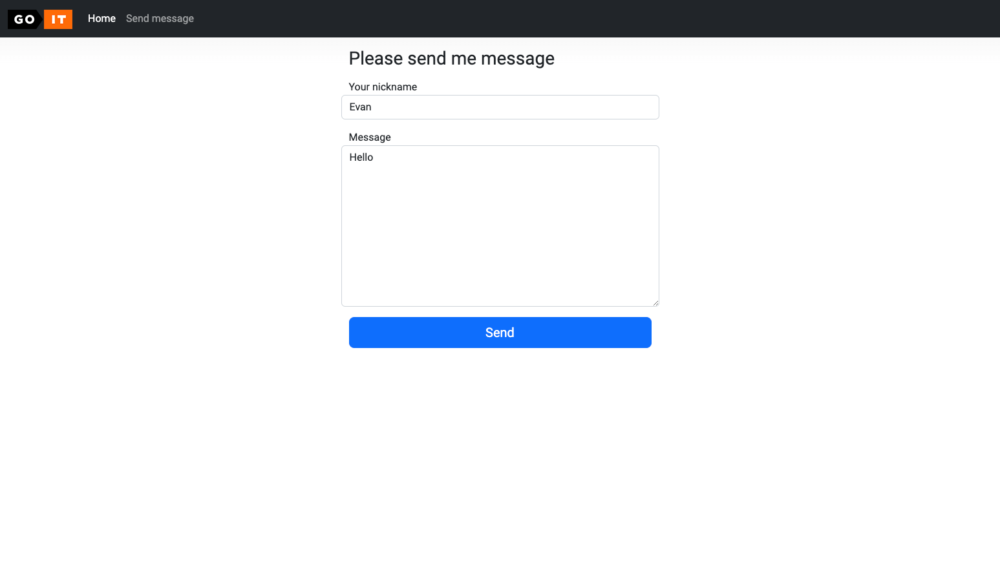
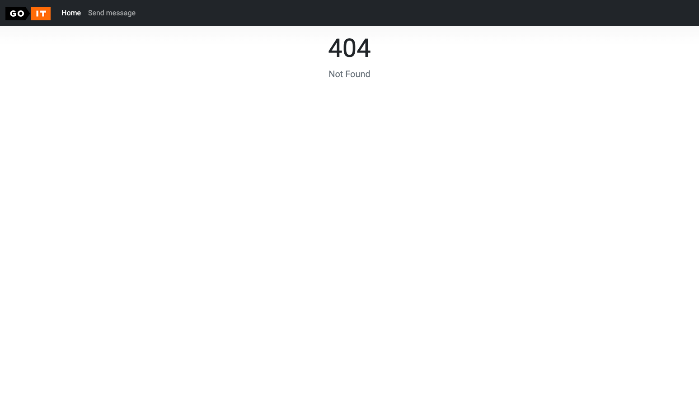

# Вебзастосунок із використанням сокетів та MongoDB

## Опис проєкту

Цей проєкт є фінальним завданням курсу "Комп'ютерні системи". Він охоплює різні аспекти веброзробки та взаємодії сервера з клієнтом через сокети, а також збереження даних у базі MongoDB.

### **Основна функціональність**:
- **HTTP-сервер** для обробки клієнтських запитів та маршрутизації.
- **Обробка статичних ресурсів** (CSS, зображення).
- **Форма введення повідомлень** на сторінці `message.html`.
- **Socket-сервер** для прийому та обробки повідомлень через протокол UDP/TCP.
- **Збереження повідомлень у MongoDB**.
- **Запуск у Docker-контейнерах** із використанням `docker-compose`.

## **Структура проєкту**

```
/goit-cs-hw-06
│── web_application/
│   │── Dockerfile
│   │── docker-compose.yaml
│   │── main.py
│   │── requirements.txt
│   │── static/
│   │   ├── style.css
│   │   ├── logo.png
│   │── templates/
│   │   ├── index.html
│   │   ├── message.html
│   │   ├── error.html
│── pics/
│   ├── screen_1.png
│   ├── screen_2.png
│   ├── screen_3.png
│   ├── screen_4.png
```

## **Запуск проєкту**

### **1. Запуск у Docker**
Проєкт повністю контейнеризований. Для запуску виконайте команду:
```sh
docker-compose up --build
```
Це створить та запустить:
- HTTP-сервер
- Socket-сервер
- MongoDB збереження

### **2. Локальний запуск без Docker**
Встановіть залежності:
```sh
pip install -r web_application/requirements.txt
```
Запустіть HTTP-сервер:
```sh
python web_application/main.py
```

## **Формат запису даних у MongoDB**
```json
{
  "date": "2022-10-29 20:20:58.020261",
  "username": "krabaton",
  "message": "First message"
}
```

## **Основні технології**
- **Python** (HTTP-сервер, сокети, обробка запитів)
- **MongoDB** (збереження повідомлень)
- **Docker** (контейнеризація)
- **Docker Compose** (автоматизація розгортання)

## **Покращення, які були впроваджені**
- ✅ Захист від XSS (екранування введених користувачем даних).
- ✅ Стиснення Gzip для швидшого завантаження сторінок.
- ✅ Обмеження довжини повідомлення (500 символів).
- ✅ Обробка HTTP-помилок (404, 500).
- ✅ Очікування готовності MongoDB перед запуском серверів.
- ✅ Додано `HEALTHCHECK` у Dockerfile для автоматичного перезапуску контейнера у разі збоїв.

## **Скріншоти**

Приклади роботи застосунку:






## **Автори**
Проєкт створений у межах фінального завдання курсу "Комп'ютерні системи". 🚀
